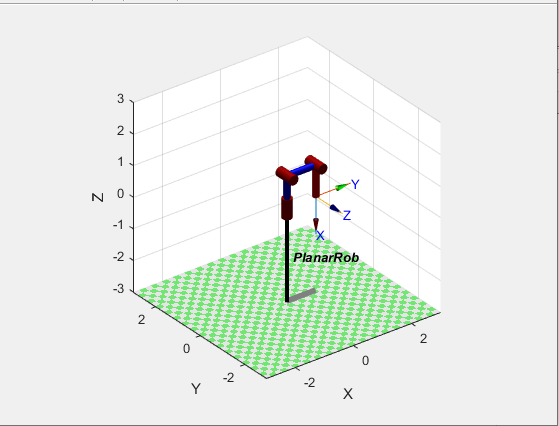
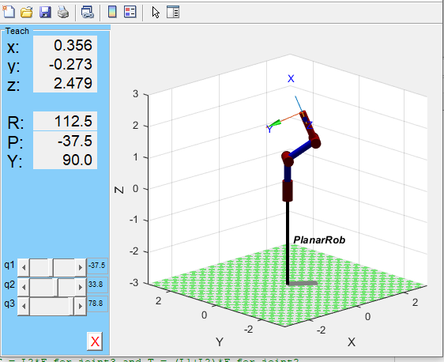

# RRR Manipulator Model


## Goal:
 ### 1. Model 3DOF RRR manipulaor using the Robot Toolbox for Matlab/Simulink (http://www.petercorke.com).
 ### 2. Move joints
 ### 3. Add load and find torque when robot is in Hold position and in Home position
 ### 4. Why the torques are different for different configurations
 
 
 ## RRR Robot model
 
 ## Control joint angles
```script
    holdPos= [0 0 0 ];
    homePos = [0 0 -pi/2];
    PlanarRob.plot(holdPos);
    PlanarRob.teach();
 ```
 
 ## Add load
 ```script
 PlanarRob.payload(1, [0 0 0]);
torqueHomePos = PlanarRob.gravload(homePos, [0 0 1]);
%%
%%         0   11.0000    0.0000
%%
torqueHoldPos = PlanarRob.gravload(holdPos, [0 0 1]);
 %%
 %%        0.0000   12.0000    1.0000
 %%
 ```
 
 ## Why the torques are different for different configurations 
We know that T = distancexForcexsin(Theta) 
In first case (home position): angle theta between Force and distance from joint3 to end effector is 0, also torque on joint2 will decrease.
In second case(hold position): angle theta between in both joints 90 deg therefore T = L2xF for joint3 and T = (L1+L2)xF for joint2
